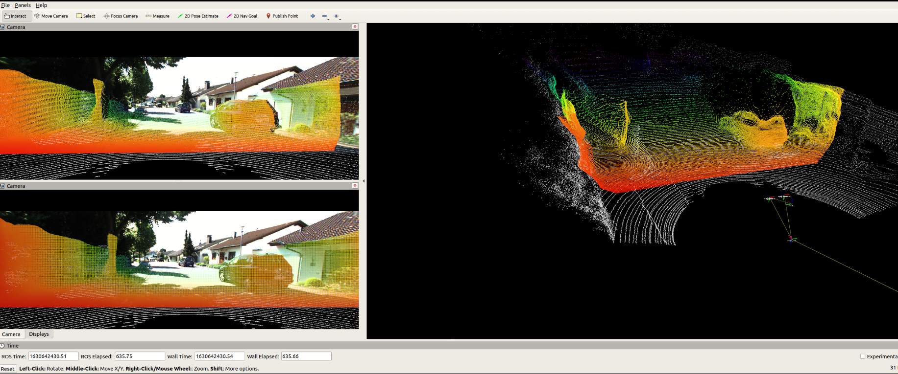

## MonoDepth ROS Node

This repo contains a Monodepth Ros node. Best worked with https://github.com/Owen-Liuyuxuan/FSNet

Recommend working with https://github.com/Owen-Liuyuxuan/kitti360_visualize / https://github.com/Owen-Liuyuxuan/kitti_visualize

All parameters are exposed in the launch file.

### Subscribed Topics

image_raw ([sensor_msgs/Image](http://docs.ros.org/en/api/sensor_msgs/html/msg/Image.html))

A stream of rectifiled image to be predicted using monodepth.

camera_info ([sensor_msgs/CameraInfo](http://docs.ros.org/en/api/sensor_msgs/html/msg/CameraInfo.html))

Camera calibration information of the rectified image.

### Published Topics

point_cloud ([sensor_msgs/PointCloud2](http://docs.ros.org/en/api/sensor_msgs/html/msg/PointCloud2.html))

Predicted point clouds.
